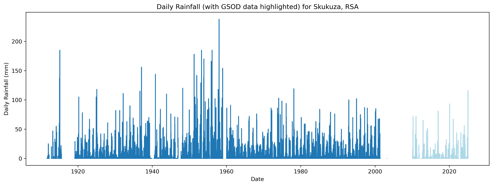
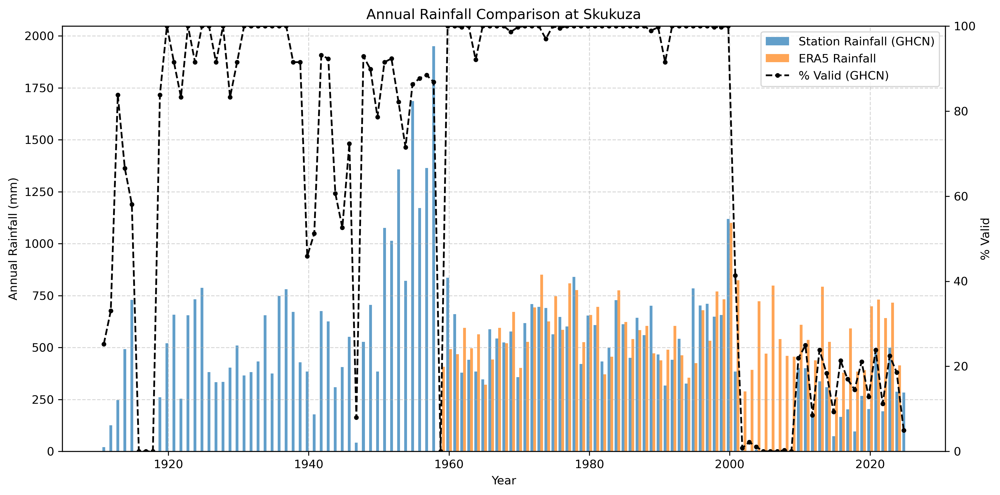
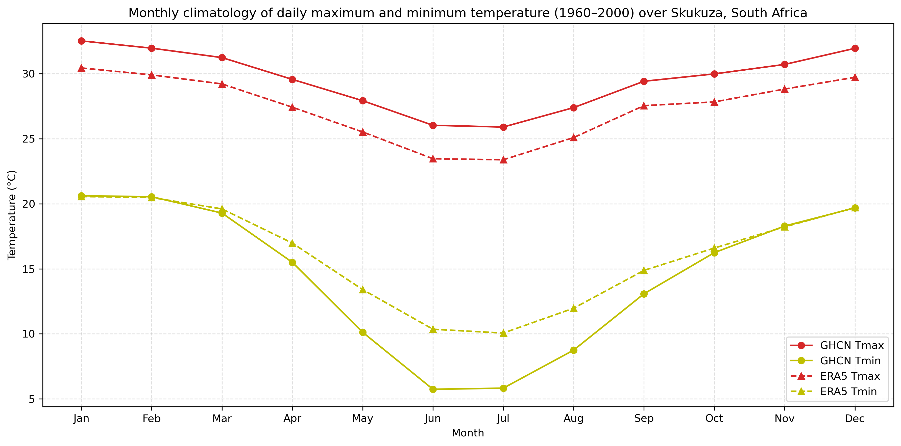

::: {.page-tabs .panel-tabset}

## Overview

<h2>About the data</h2>

The Global Historical Climatology Network daily (GHCNd) is the world's largest collection of daily station-based weather observations, maintained by NOAA's National Centers for Environmental Information (NCEI). GHCNd provides actual measurements from over 100,000 land-based stations worldwide, with some records extending back to the 18th century. The dataset includes daily maximum/minimum temperatures, precipitation and other variables, offering direct observations of climate conditions at specific locations.
GHCNd undergoes rigorous quality assurance reviews and data is updated daily with a latency of 24-48 hours for many stations. Each daily update to GHCNd is assigned a unique version number, and then archived at NCEI. 
The dataset is particularly valuable for the validation of gridded observational climate products/datasets, local-scale climate studies, extreme event analysis and long-term trend assessments.
For more information regarding the GHCNd dataset see [GHCNd](https://www.ncei.noaa.gov/products/land-based-station/global-historical-climatology-network-daily).

Users can also find more information about the GHCNd dataset here:

- Climate Data Guide: [GHCN-D: Global Historical climatology Network](https://climatedataguide.ucar.edu/climate-data/ghcn-d-global-historical-climatology-network-daily-temperatures)

**Summary**

| | |
--- | --- |
| **Name** | GHCNd (Global Historical Climatology Network daily) |
| **Institution** | [NCEI](https://www.ncei.noaa.gov/) |
| **Product type** | station observations |
| **Domain** | global |
| **Resolution** |   point locations |
| **Period** | 1700s - present (varies by station) |
| **Frequencies** | daily |
| **Variables** | precipitation, temperature, others  |
| **Update frequency (latency)** | daily (24-48 hours) |

 
**Variables**
 

|  **Variable Name**   |  **Variable Description**  |  **Units**  |
--- | --- | --- |
| PRCP |  Precipitation |  millimetres per day |
| TMAX | Maximum temperature | degrees Celsius |
| TMIN | Minimum temperature | degrees Celsius |
| TAVG | Average temperature | degrees Celsius |

For a comprehensive list of variables, you can refer to the dataset's documentation on the [GHCNd Documention](https://www.ncei.noaa.gov/data/global-historical-climatology-network-daily/doc/GHCND_documentation.pdf).

 

<h2>Accessing the data</h2>

GHCNd data can be downloaded from several different platforms.

::: {.panel-tabset}
### Data Creator
The [National Centers for Environmental Information (NCEI)](https://www.ncei.noaa.gov/) is the creator and maintainer of the GHCNd dataset. The dataset is updated daily and the data is subjected to a suite of quality checks. Each daily update to GHCNd is assigned a unique [version number](https://www.ncei.noaa.gov/pub/data/ghcn/daily/ghcnd-version.txt), and then archived at NCEI.

The NCEI provides access to the GHCNd dataset via a [data archive](https://www.ncei.noaa.gov/data/global-historical-climatology-network-daily/), where users can download individual station records in CSV format or as a GZIP-compressed TAR file containing all of the station files. Descriptions of the metadata and data file formats are provided in the [GHCNd documentation](https://www.ncei.noaa.gov/data/global-historical-climatology-network-daily/doc/GHCND_documentation.pdf). This is the best source for accessing the most up-to-date version of the dataset.

#### Metadata-Inventories
Additional metadata and inventories are available, including:
[Stations](https://www.ncei.noaa.gov/pub/data/ghcn/daily/ghcnd-stations.txt): Station ID, latitude, longitude, elevation, State (if applicable), and Station name. 
[Inventory](https://www.ncei.noaa.gov/pub/data/ghcn/daily/ghcnd-inventory.txt): Station ID, latitude, longitude, element type, and begin/end date
[Documentation](https://www.ncei.noaa.gov/data/global-historical-climatology-network-daily/doc/GHCND_documentation.pdf): Data format, element definitions, and Station variables
[Country Codes](https://www.ncei.noaa.gov/pub/data/ghcn/daily/ghcnd-countries.txt): List of country codes used in the Station inventory
[Additional details](https://www.ncei.noaa.gov/pub/data/ghcn/daily/readme.txt)

|  **Version**   | **Variables**  	| **Resolution** | **Spatial Extent** | **File Format**   	|
|----------------|------------------|----------------|--------------------|---------------------|
| Latest (updated daily)  | All available variables (Station specific) 	| Point	| Global  | CSV (.csv)  |

### KNMI Climate Explorer
The [KNMI Climate Explorer](https://climexp.knmi.nl/start.cgi) is another platform where users can download GHCNd data. On the [Daily station data](https://climexp.knmi.nl/selectdailyseries.cgi?id=someone@somewhere) page, the latest version of GHCNd is typically available. Users can select a specific variable and search for stations by name, station ID, coordinates, or by a custom mask (e.g., a shapefile), and then download data for individual stations. The data are provided in a few different formats.

|  **Version**   | **Variables**  	| **Resolution** | **Spatial Extent** | **File Format**   	|
|----------------|------------------|----------------|--------------------|---------------------|
| Typically up-to-date | precipitation, average temperature, minimum temperature, maximum temperature, snowfall, snow depth (Station specific)	| Point | Global | raw text (.dat), netCDF (.nc), PDF (.pdf), eps (.eps) |
:::

<h2>What the data looks likes</h2>

Below are a few plots to give a better sense of where the GHCNd station are located. 

:::{.cell}
{fig-align="center"}
:::

:::{.cell}
{fig-align="center"}
:::

:::{.cell}
{fig-align="center"}
:::

:::{.cell}
{fig-align="center"}
:::

<h2>Key points to consider</h2>

The GHCNd dataset consists of direct station observations rather than model outputs, presenting both unique advantages and analytical challenges. Unlike spatially complete gridded datasets, GHCNd exhibits uneven geographic coverage with particularly sparse station density across much of Africa outside urban centers and former colonial observation networks, while stations in temperate regions often benefit from longer and more complete records. Individual station histories frequently contain gaps due to operational interruptions, and many records are discontinuous as stations relocate or change instrumentation - a transition that may introduce artificial shifts in the data unless properly accounted for through metadata analysis. While NOAA applies rigorous quality control including outlier detection and homogenization algorithms to create climate-quality data, residual errors may persist at individual stations due to localized effects like urbanization or microclimate influences that aren't fully corrected in the automated processing. These characteristics make GHCNd exceptionally valuable for validating gridded products and studying local climate extremes, but require careful preprocessing including gap-filling, homogeneity testing, and urban heat island screening when used for trend analysis or combined into regional composites. The dataset's strength lies in its direct measurements of weather conditions, but this comes with the responsibility for users to thoroughly understand each station's history and potential artifacts before drawing climate conclusions. Although the GHCNd dataset is updated daily, many African stations are updated irregularly and may rely on Global Summary of the Day (GSOD) feeds, with some historical records not extending to recent years, leading to delayed or incomplete data coverage compared with other regions.

<h3>Strengths</h3>

- Provides actual ground measurements rather than model estimates.
- Higher accuracy for extreme events at point locations.
- Long-term records available for trend analysis.
- Transparent quality control procedures.
- No spatial interpolation artifacts

<h3>Limitations</h3>

- Incomplete spatial coverage (especially in developing regions).
- Temporal discontinuities from station moves/equipment changes.
- Variable data latency (some stations report in near-real-time, others monthly).
- Point measurements (often at airports/urban sites) may not reflect conditions of the wider surrounding area.
- In Africa, many stations are updated irregularly and may rely on Global Summary of the Day (GSOD) feeds, resulting in delayed or incomplete data coverage compared with other regions.

<h2>Citing the data</h2>

Menne, M.J., I. Durre, R.S. Vose, B.E. Gleason, and T.G. Houston, 2012: An overview of the Global Historical Climatology Network-Daily Database. Journal of Atmospheric and Oceanic Technology, 29, 897-910. DOI:10.1175/JTECH-D-11-00103.1

<h3>Terms of use</h3>

NOAA data are generally free for all to use with proper attribution.

## Visualisations  

<h2>How to use this data?</h2>

Ground-based weather observations provide invaluable information on local-scale climate. Datasets such as GHCN (Global Historical Climatology Network) offer long-term daily records of temperature, precipitation, and other variables from individual weather stations. Analysing station data allows us to examine historical climate trends, extreme events, and seasonal patterns at specific locations. Station data can also be used to evaluate and validate gridded datasets, such as ERA5.

In this example, we use GHCN station data from Skukuza, South Africa. The station has a long record spanning 1911–2025 and includes precipitation and temperature variables. We will examine the sources of the data in the station record and discuss potential issues that users should be aware of. Finally, we compare the station data with ERA5 data for the grid cell containing Skukuza to explore any differences between the datasets.

To generate the visualisations, we downloaded the [station data file](https://www.ncei.noaa.gov/data/global-historical-climatology-network-daily/access/SF000068296.csv) for Skukuza and applied the following preparation steps:

- Variable unit correction: GHCN stores many variables in tenths of their true value. Values were divided by 10 to convert them to standard units.

- Add missing time steps: Any missing dates in the station record were added to create a continuous daily time series, ensuring that all days between the start and end of the record are represented.

For the ERA5 data, we used daily average, minimum, and maximum temperature, as well as precipitation. Time-series data for these four variables were extracted for the grid cell containing Skukuza.

<h2>How to plot the data?</h2>

The GHCN Skukuza station rainfall record spans 1 September 1911 to 24 July 2025, with valid (non-missing) values available for 70.95% of the record. After 30 May 2001, the source of the data changes to the Global Summary of the Day (GSOD), meaning the values are derived from hourly synoptic reports exchanged via the Global Telecommunications System (GTS). GHCN cautions that “daily values derived in this fashion may differ significantly from ‘true’ daily data, particularly for precipitation (i.e., use with caution).” This change in source is highlighted in Figure 1.

:::{.cell}

:::

The GHCN Skukuza station has three temperature variables. Maximum and minimum temperatures are recorded from 1 January 1960 to 24 July 2025, with valid (non-missing) values available for around 80% of their records. As with the rainfall record, after 30 May 2001 the source of the data changes to the Global Summary of the Day (GSOD). All values for the average temperature variable are sourced from GSOD (Figure 2).

:::{.cell}

:::

In Figure 3, we compare annual rainfall totals between the GHCN station record (blue bars) and the ERA5 grid cell (orange bars) over Skukuza. Annual rainfall provides a useful visual metric for assessing whether datasets capture comparable magnitudes of total rainfall. The percentage of valid (non-missing) daily values for the GHCN station is also shown in Figure 3 (black dots and line).

As annual rainfall sums daily values, data completeness is crucial. Figure 3 highlights the post-2001 GSOD data issue, where no year exceeds 30% valid observations. Overall, 74 of 115 years have ≥80% completeness, and 64 years exceed 90%.

:::{.cell}

:::

Figure 4 shows a similar drop in temperature data completeness after 2001 when the source switches to GSOD. The daily average temperature variable consists entirely of GSOD data and is therefore excluded from further analysis.

Given the good data completeness of the station record for maximum and minimum temperature, as well as precipitation, over the roughly 40-year period between 1960 and 2001—which overlaps with the ERA5 dataset—we focus on this period for comparing the two datasets.

:::{.cell}

:::

Figure 5 compares the monthly rainfall climatology from the GHCN station and the ERA5 reanalysis for Skukuza, averaged over 1960–2000. It shows two key metrics for each dataset: mean monthly rainfall and the mean number of rain days per month. Both datasets capture the strong seasonal rainfall cycle characteristic of the region, with a pronounced wet season during summer (November–March) and a dry season in winter (May–August). Although the timing of wet and dry seasons aligns between GHCN and ERA5, differences in rainfall magnitude and number of rain days show how station-based and gridded datasets can represent local climate differently. In particular, ERA5 consistently shows more rain days, with similar monthly average rainfall totals, suggesting it captures more low-intensity rainfall events than the GHCN station.

:::{.cell}

:::

Figure 6 compares the monthly climatologies of maximum and minimum temperatures between the GHCN station and the ERA5 grid cell at Skukuza, averaged over 1960–2000. The mean daily maximum temperature from ERA5 is consistently cooler than the station record across all months, suggesting a potential bias in the reanalysis. For minimum temperature, ERA5 is slightly warmer than the station during the winter/dry season months, but aligns closely with GHCN observations in summer/wet season.

:::{.cell}

:::

These visualisations highlight the strengths and limitations of both station-based and gridded datasets. The GHCN station provides detailed daily observations over a long period, capturing historical variability, seasonal cycles, and extremes, although users should account for record completeness and changes in data source. ERA5 reanalysis offers continuous gridded coverage and captures seasonal patterns, but may differ from the station in the magnitude and frequency of events. Comparing annual totals, monthly climatologies, and data completeness helps users understand the characteristics of both datasets and make informed decisions based on the temporal and spatial scale of interest.

## Modelling

:::