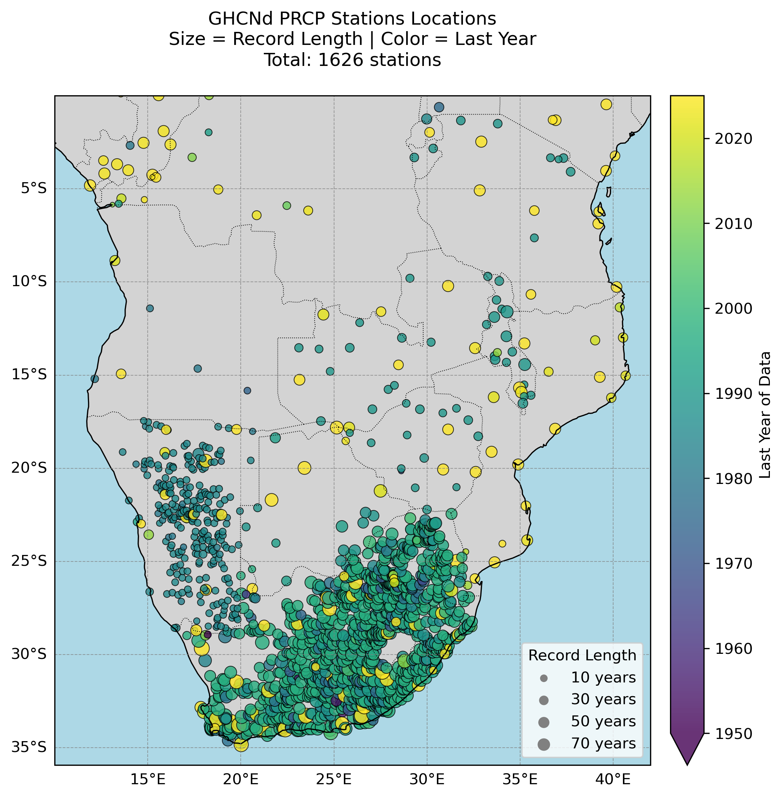
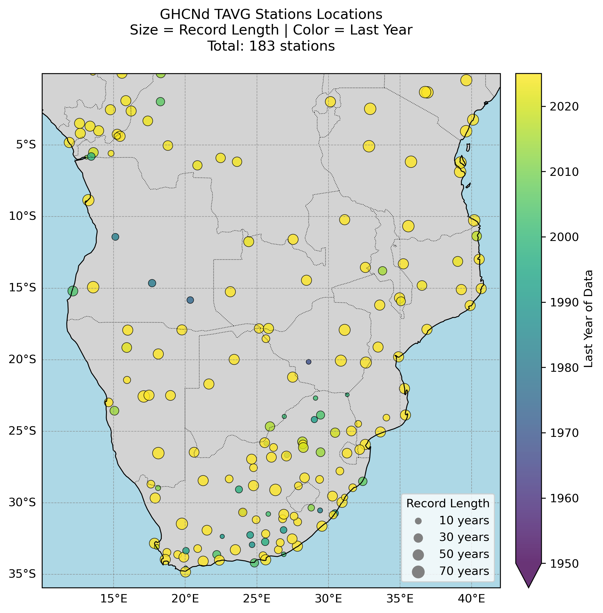
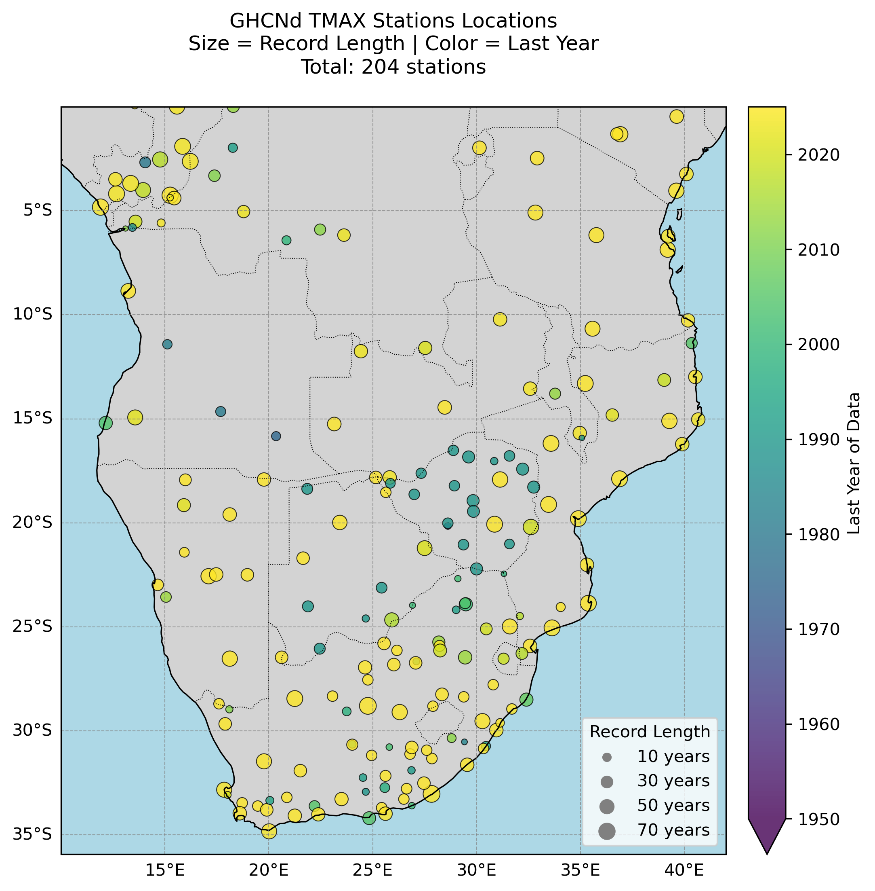
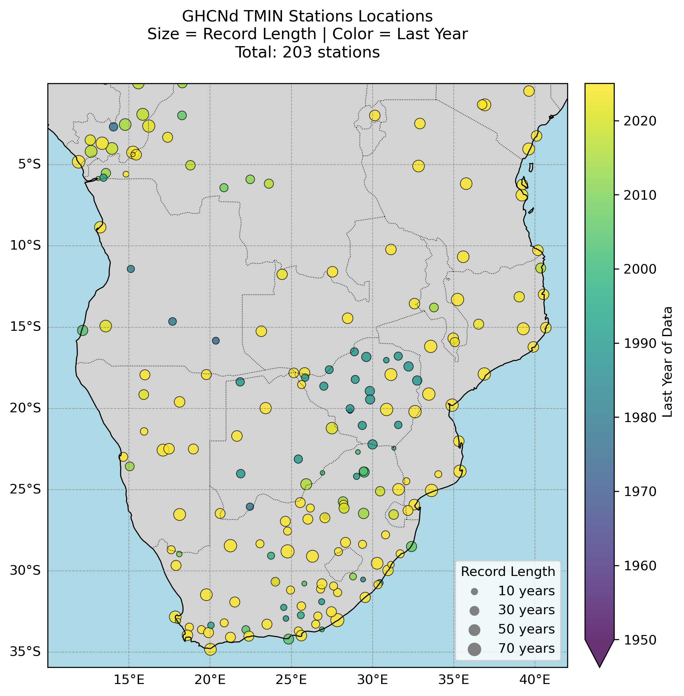

::: {.page-tabs .panel-tabset}

## Overview

<h2>About the data</h2>

The Global Historical Climatology Network daily (GHCNd) is the world's largest collection of daily station-based weather observations, maintained by NOAA's National Centers for Environmental Information (NCEI). GHCNd provides actual measurements from over 100,000 land-based stations worldwide, with some records extending back to the 18th century. The dataset includes daily maximum/minimum temperatures, precipitation and other variables, offering direct observations of climate conditions at specific locations.
GHCNd undergoes rigorous quality assurance reviews and data is updated daily with a latency of 24-48 hours for many stations. Each daily update to GHCNd is assigned a unique version number, and then archived at NCEI. 
The dataset is particularly valuable for the validation of gridded observational climate products/datasets, local-scale climate studies, extreme event analysis and long-term trend assessments.
For more information regarding the GHCNd dataset see [GHCNd](https://www.ncei.noaa.gov/products/land-based-station/global-historical-climatology-network-daily).

Users can also find more information about the GHCNd dataset here:

- Climate Data Guide: [GHCN-D: Global Historical climatology Network](https://climatedataguide.ucar.edu/climate-data/ghcn-d-global-historical-climatology-network-daily-temperatures)

**Summary**

| | |
--- | --- |
| **Name** | GHCNd (Global Historical Climatology Network daily) |
| **Institution** | [NCEI](https://www.ncei.noaa.gov/) |
| **Product type** | station observations |
| **Domain** | global |
| **Resolution** |   point locations |
| **Period** | 1700s - present (varies by station) |
| **Frequencies** | daily |
| **Variables** | precipitation, temperature, others  |
| **Update frequency (latency)** | daily (24-48 hours) |

 
**Variables**
 

|  **Variable Name**   |  **Variable Description**  |  **Units**  |
--- | --- | --- |
| PRCP |  Precipitation |  millimetres per day |
| TMAX | Maximum temperature | degrees Celsius |
| TMIN | Minimum temperature | degrees Celsius |
| TAVG | Average temperature | egrees Celsius |

For a comprehensive list of variables, you can refer to the dataset's documentation on the [GHCNd Documention](https://www.ncei.noaa.gov/data/global-historical-climatology-network-daily/doc/GHCND_documentation.pdf).

 

<h2>Accessing the data</h2>

GHCNd data can be downlaoded from several different platforms.

::: {.panel-tabset}
### Data Creator

|  **Version**   | **Variables**  	| **Resolution** | **Spatial Extent** | **File Format**   	|
|----------------|------------------|----------------|--------------------|---------------------|
|   |  	| 	|  |   |

### KNMI Climate Explorer
The [KNMI Climate Explorer](https://climexp.knmi.nl/start.cgi) provides access to 

|  **Version**   | **Variables**  	| **Resolution** | **Spatial Extent** | **File Format**   	|
|----------------|------------------|----------------|--------------------|---------------------|
|  | 	|  |  |
:::

<h2>What the data looks likes</h2>

Below are a few plots to give a better sense of where the GHCNd station are located. 

:::{.cell}
{fig-align="center"}
:::

:::{.cell}
{fig-align="center"}
:::

:::{.cell}
{fig-align="center"}
:::

:::{.cell}
{fig-align="center"}
:::

<h2>Key points to consider</h2>

The GHCNd dataset consists of direct station observations rather than model outputs, presenting both unique advantages and analytical challenges. Unlike spatially complete gridded datasets, GHCNd exhibits uneven geographic coverage with particularly sparse station density across much of Africa outside urban centers and former colonial observation networks, while stations in temperate regions often benefit from longer and more complete records. Individual station histories frequently contain gaps due to operational interruptions, and many records are discontinuous as stations relocate or change instrumentation - a transition that may introduce artificial shifts in the data unless properly accounted for through metadata analysis. While NOAA applies rigorous quality control including outlier detection and homogenization algorithms to create climate-quality data, residual errors may persist at individual stations due to localized effects like urbanization or microclimate influences that aren't fully corrected in the automated processing. These characteristics make GHCNd exceptionally valuable for validating gridded products and studying local climate extremes, but require careful preprocessing including gap-filling, homogeneity testing, and urban heat island screening when used for trend analysis or combined into regional composites. The dataset's strength lies in its direct measurements of weather conditions, but this comes with the responsibility for users to thoroughly understand each station's history and potential artifacts before drawing climate conclusions.

<h3>Strengths</h3>

- Provides actual ground measurements rather than model estimates.
- Higher accuracy for extreme events at point locations.
- Long-term records available for trend analysis.
- Transparent quality control procedures.
- No spatial interpolation artifacts

<h3>Limitations</h3>

- Incomplete spatial coverage (especially in developing regions).
- Temporal discontinuities from station moves/equipment changes.
- Variable data latency (some stations report in near-real-time, others monthly).
- Point measurements (often at airports/urban sites) may not reflect conditions of the wider surrounding area.

<h2>Citing the data</h2>

Menne, M.J., I. Durre, R.S. Vose, B.E. Gleason, and T.G. Houston, 2012: An overview of the Global Historical Climatology Network-Daily Database. Journal of Atmospheric and Oceanic Technology, 29, 897-910. DOI:10.1175/JTECH-D-11-00103.1

<h3>Terms of use</h3>

NOAA data are generally free for all to use with proper attribution.

## Visualisations  

<h2>How to use this data?</h2>

## Modelling

:::